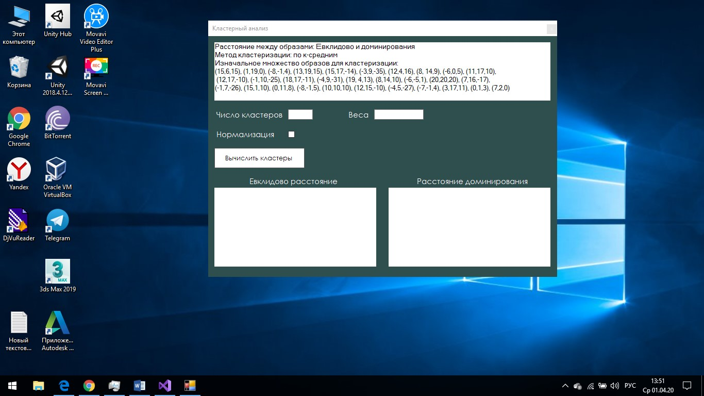

# Clusters analysis

The program is developed in C# using the WinForm UI library.__Clustering is a Machine Learning technique that involves the grouping of data points.__The main function of the program is clustering  the input set of points, using different methods for this._
K-Means Clustering method.

Determining the distance between points: euclidean distance and dominance distance.

Interface state with initial values for clustering: 
 

Found clusters after clustering:
 
